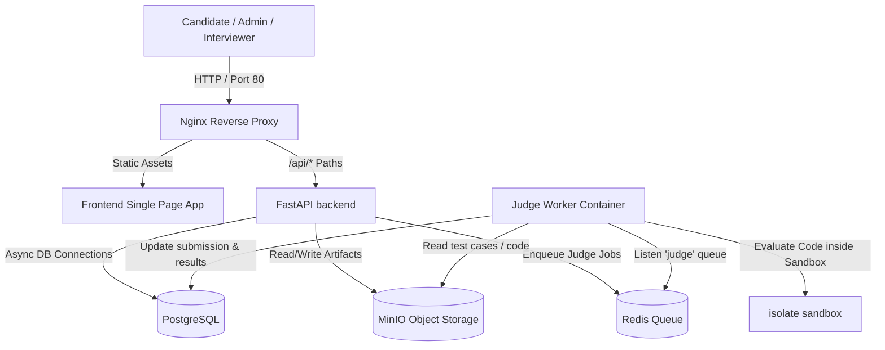

# 🚀 Cloud-Native Online Judge System

An enterprise-grade Cloud-Native Online Judge (OJ) and Interview system built with **FastAPI**, **React (TypeScript)**, **Docker Compose**, **Redis Queue (RQ)**, **MinIO**, and secure **Isolate Sandbox** integration.

This platform supports multi-tenant roles (Admin, Problem Admin, Interviewer, Candidate), secure code execution, precise runtime metrics capture, and fully containerized local setups.

---

## 🏗️ System Architecture



---

## ✨ Core Features

*   **Multi-Role Authorization**: Scoped permissions across:
    *   `admin`: Full system oversight, configuration, and tenant auditing.
    *   `problem_admin`: Creation of test cases, time limits, memory limits, and target language profiles.
    *   `interviewer`: Creation of exams, allocation of problems to specific candidates, and scoring reports.
    *   `candidate`: Monaco editor support, real-time feedback, and secure code submissions.
*   **Secure Execution Sandbox (`isolate`)**: Full file system, memory limits (MLE), CPU execution limits (TLE), and process namespace isolation utilizing standard Linux cgroups.
*   **High Performance Event Queue**: Queueing of grading workloads over Redis Queue (`RQ`) avoiding request starvation.
*   **MinIO Object Storage**: Cloud-native test case management and solution source code archival.

---

## 🛠️ Local Development Setup

To boot this system locally, ensure you have **Docker** and **Docker Compose** installed.

### 1. Configure Environment Variables
Copy the template configuration file to a live `.env` file:
```bash
cp ".env copy.example" .env
```
Ensure you inspect `.env` to configure your initial administrator user and storage keys:
```ini
SECRET_KEY=changeme-use-a-long-random-string-in-production
ADMIN_EMAIL=admin@example.com
ADMIN_PASSWORD=changeme
ADMIN_NAME=System Admin
MINIO_ACCESS_KEY=minioadmin
MINIO_SECRET_KEY=minioadmin
```

### 2. Boot Services
Start the entire stack using Docker Compose:
```bash
docker compose up --build
```
> **Note for Worker Sandbox Support**: The `judge-worker` container uses `isolate`, which requires cgroup manipulations. The service is pre-configured with `cap_add: [SYS_ADMIN]` and `security_opt: [seccomp:unconfined]` to allow namespaces creation safely inside the container.

---

## 🔗 Port & Navigation Guide

Once the docker containers are active, you can access the components at the following local interfaces:

| Service | Access Endpoint | Credentials / Details |
| :--- | :--- | :--- |
| **Frontend Web App** | [http://localhost](http://localhost) | Port `80` (Proxied via Nginx) |
| **API Swaggger Docs** | [http://localhost/api/docs](http://localhost/api/docs) | OpenAPI interactive docs |
| **MinIO Console** | [http://localhost:9001](http://localhost:9001) | User: `minioadmin` \| Password: `minioadmin` |
| **PostgreSQL DB** | `localhost:5432` | User: `oj` \| Password: `oj` \| DB: `oj` |

---

## 💾 Seed Sample Data

The backend provides a pre-configured database schema setup. When the API boots, it runs migrations automatically (`alembic upgrade head`).

To seed a sample test exam, problems, and test cases:
1. Ensure the PostgreSQL container is running.
2. Run the seed SQL file inside the database container:
```bash
docker compose exec -T postgres psql -U oj -d oj < backend/seed_sample_exam.sql
docker compose exec -T api uv run python seed_testcases.py
```
This imports demo data including:
*   Pre-configured coding questions.
*   Associated sandbox test cases.
*   Sample mock exams and candidate allocations.

---

## 🧑‍💻 Component-Specific Dev Rules (Optional)

If you'd like to work on individual parts locally without containers:

### Backend Development (`/backend`)
Prerequisites: Python `3.12+` and `uv` package manager.
```bash
cd backend
# Sync local dependencies
uv sync --no-dev
# Run tests
uv run pytest
```

### Frontend Development (`/frontend`)
Prerequisites: Node.js and `pnpm` (configured in alignment with package guidelines).
```bash
cd frontend
# Install dependencies
pnpm install
# Run hot-reloading dev server
pnpm dev
# Run tests
pnpm test
```
