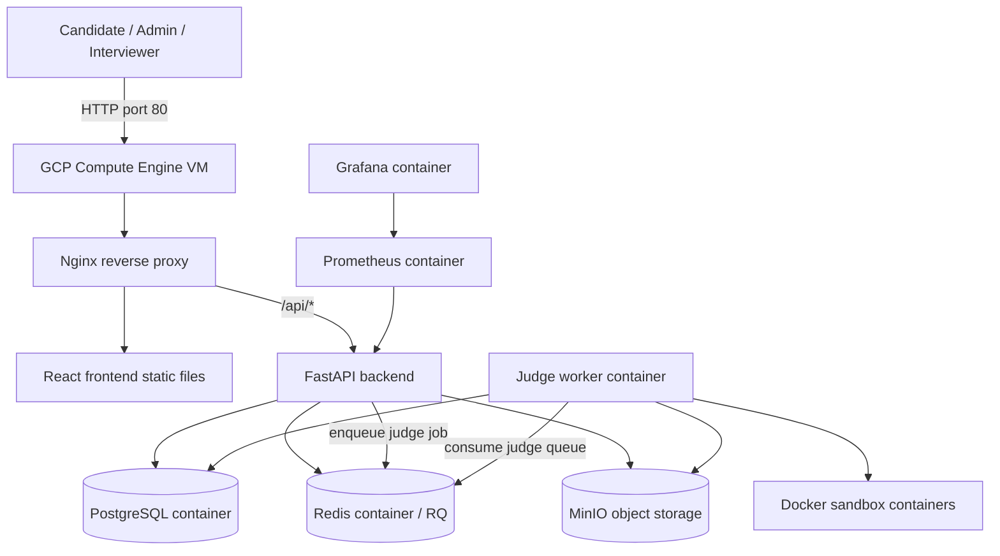
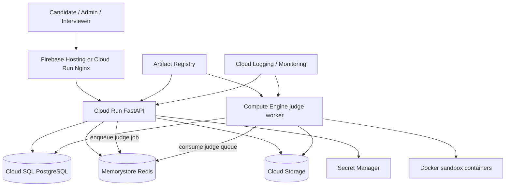

# GCP Architecture

This document explains the part C deployment strategy for the Online Judge
system. The current course demo runs on a single GCP Compute Engine VM. The
future production design can split managed services while keeping the judge
worker on controlled compute.

## Current VM Demo Architecture

This deployment is simple to reproduce on a new server and keeps all moving
parts visible for the demo. It also matches the judge worker requirement: the
worker must run candidate code in sandbox containers and therefore needs a host
where Docker access and resource controls are available.

## Future Managed GCP Architecture

## Service Mapping

| Current service | Current deployment | Future GCP service |
| --- | --- | --- |
| Frontend | Nginx container on VM | Firebase Hosting or Cloud Run Nginx |
| API | FastAPI container on VM | Cloud Run |
| Database | PostgreSQL container | Cloud SQL PostgreSQL |
| Queue | Redis container | Memorystore Redis |
| Storage | MinIO container | Cloud Storage through a storage adapter |
| Judge worker | Worker container on VM | Compute Engine VM or dedicated GKE node pool |
| Images | Built on VM | Artifact Registry |
| Secrets | `.env` on VM | Secret Manager |
| Logs and metrics | Docker logs, Prometheus, Grafana | Cloud Logging, Cloud Monitoring, or managed Prometheus |

## Why the Judge Worker Stays on Compute Engine

Cloud Run is a good fit for stateless HTTP services such as the FastAPI backend,
but the judge worker is different:

- It executes untrusted candidate code.
- It creates sandbox containers for Python and C++ runtime isolation.
- It relies on Docker-level controls such as network isolation, memory limits,
  CPU limits, process limits, and cleanup.
- It may require Docker socket access or privileged-like host capabilities that
  are not a normal Cloud Run workload model.

For this reason, the production split should move the API and managed
dependencies first, while keeping the judge worker on Compute Engine or a
dedicated GKE node pool with explicit sandbox controls.

## Deployment Strategy

1. Demo stage: run the complete Docker Compose stack on a GCP VM.
2. Reliability stage: add documented health checks, worker logs, and queue
   metrics to the deployment checklist.
3. Managed service stage: move PostgreSQL to Cloud SQL and Redis to Memorystore.
4. Storage stage: replace MinIO with Cloud Storage through a storage adapter.
5. API stage: deploy FastAPI to Cloud Run using images from Artifact Registry.
6. Worker stage: keep the judge worker on controlled compute and connect it to
   the managed DB, queue, and storage services.

