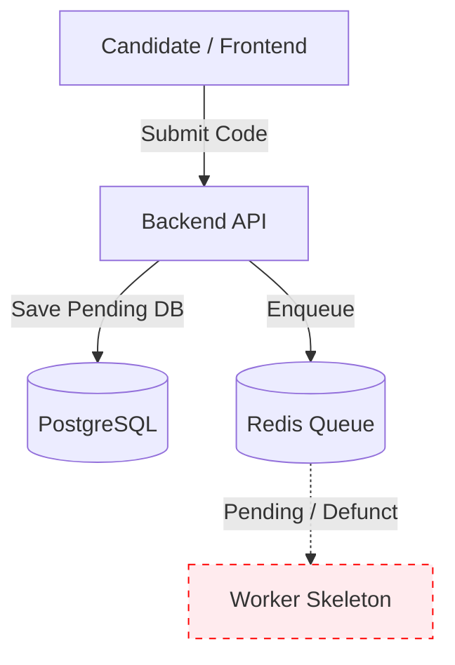

# Online Judge System - Development TODO List

This document tracks the current implementation progress, identified bugs, missing core functionalities, and proposed fixes for the OJ (Online Judge) system.

---

## 📊 Current System State

### ✅ Already Implemented (Skeleton & Prototype CRUD)
- [x] **Authentication & Role System**: Supporting JWT & refresh tokens across `admin`, `interviewer`, `problem_admin`, and `candidate`.
- [x] **Problem Administration**: UI and APIs for creating problems, configuring test cases, memory/time limits, and specifying allowed languages (`python3`, `cpp17`).
- [x] **Exam Management**: Interface for interviewers to create exams, assign problems, and view student scores.
- [x] **Candidate Workspace**: Monaco editor integration allowing candidates to view exam problems, write solutions, and trigger a submission.
- [x] **Submission Pipeline (Initial)**: Saves code, sets state to `pending`, and pushes jobs to Redis Queue (`RQ`).
- [x] **Infrastructure**: Basic Docker Compose setup configuring Postgres, Redis, MinIO, API, Frontend, and Worker skeletons.

---

## 🚨 Critical Missing Features & Bugs

### 1. ⚙️ Online Judge Worker & Grading Engine (Highest Priority)
- [ ] **Implement `worker.py` and `judge_submission`**: The queue currently enqueues a non-existent task (`worker.judge_submission`).
  * *Location:* `backend/app/services/queue.py` (Line 19)
- [ ] **Configure Worker Queue Listening**: The worker Docker container currently listens to the `default` queue instead of the designated `judge` queue.
  * *Location:* `backend/Dockerfile.worker` (Line 23)
- [ ] **Real Grading & Scoring Logic**: Submissions currently remain stuck in `pending`.
  * We need to fetch the submission metadata and test cases from MinIO/DB, compile (for C++), execute against inputs, compare with outputs, and write back verdicts (`AC`, `WA`, `TLE`, `MLE`, `RE`).
- [ ] **Queue Error Recovery**: Submission tasks that fail inside the queue are swallowed, leaving the candidate waiting indefinitely on a `pending` status.
  * *Location:* `backend/app/services/submission.py` (Line 102)

### 2. 🛡️ Sandbox & Security Isolation
- [ ] **Isolate Integration**: While the `isolate` sandbox utility is installed in the worker's Docker container, the backend does not execute user code inside it.
- [ ] **Enforce Constraints**:
  * Execute solutions with CPU/Time limit controls.
  * Enforce memory usage limits (`MLE`).
  * Restrict network access and file system permissions.
  * Restrict malicious code patterns (e.g., executing system calls, fork bombs).

### 3. 🔐 API Permissions & Access Control
- [ ] **Restrict Problem Viewing for Candidates**: Candidates can query and see any system problem using `/problems` and `/problems/{id}` without verifying if the problem belongs to their active exam.
  * *Location:* `backend/app/routers/problem.py` (Line 19)
- [ ] **Enforce Exam Start Time**: Submissions are only blocked after an exam's `end_time` has elapsed. There is no validation blocking submissions before the exam has officially started.
  * *Location:* `backend/app/services/submission.py` (Line 75)
- [ ] **Validate Allowed Languages per Problem**: The backend validates the code format against global `python3` / `cpp17` options but doesn't check if the specific problem allows that language (`allowed_langs`).

### 4. 👥 Interviewer Workflow & RBAC Conflict
- [ ] **Resolve Candidate Query Permissions**: The frontend allows an `interviewer` to view/create candidates, but lists all candidates using an endpoint (`apiListAdminUsers` / `list_users`) that strictly requires `admin` privileges, preventing interviewers from assigning candidates to exams.
  * *Location (Backend):* `backend/app/services/admin.py` (Line 89)
  * *Location (Frontend):* `frontend/src/pages/ExamManagePage.tsx` (Line 67)

### 5. 🧪 Testing & CI/CD Pipeline
- [ ] **Fix Backend Pytest Imports**: `uv run --extra dev pytest` fails due to `tests/test_admin.py` importing `deactivate_user`, which is missing.
- [ ] **Fix Frontend Package Manager & Dependencies**:
  * There is no `pnpm-lock.yaml`, causing `pnpm install --frozen-lockfile` to fail.
  * CI pipeline and frontend Docker configuration currently use `npm`, which is inconsistent with the `AGENTS.md` rule requesting `pnpm`.
  * *Location (CI):* `.github/workflows/ci.yml` (Line 49)
  * *Location (Frontend Docker):* `frontend/Dockerfile` (Line 5)

---

## 🛠️ Recommended Implementation Sequence

```mermaid
gantt
    title Recommended Implementation Plan
    dateFormat  X
    axisFormat %d
    
    section Core Judging
    Implement Worker & Judge Engine     :active, p1, 0, 3
    Fix Worker Docker Queue & Failures  :active, p2, 3, 5
    
    section Sandbox Security
    Integrate isolate Sandbox Container :p3, 5, 8
    
    section API Security
    Candidate Problem & Exam Checks    :p4, 8, 10
    Language Allowed Lang Validation   :p5, 10, 11
    
    section Interviewer Fix
    Fix Candidate Admin/Interviewer RBAC:p6, 11, 13
    
    section CI & Testing
    Align Frontend to pnpm & Fix tests :p7, 13, 15
```

### Phase 1: Core Grading & Queue Pipeline
1. Create `worker.py` in backend containing the `judge_submission` function.
2. Update `backend/Dockerfile.worker` to listen to the `judge` queue.
3. Handle failure modes in `backend/app/services/submission.py` to transit status to `failed` on queue errors.

### Phase 2: Sandbox Security
1. Write a sandbox wrapper in Python that spawns `isolate` commands.
2. Pass time & memory limits parsed from the problem metadata to `isolate`.
3. Safely capture stdout, stderr, and metadata files generated by `isolate`.

### Phase 3: Router Permissions & Exam Rules
1. Restrict `/problems/{id}` to ensure that if the user is a `candidate`, they can only see the problem if it is linked to an active exam they are enrolled in.
2. Update the submission service to check `exam.start_time` and match against the problem's `allowed_langs`.

### Phase 4: Role-Based Access Control Adjustments
1. Refactor list users to either allow interviewers to view candidates specifically, or create a scoped endpoint for candidate lists.

### Phase 5: Build Environment & Alignment
1. Resolve the `deactivate_user` import issue in backend unit tests.
2. Generate the lockfile for frontend, update the Dockerfile, and update the CI config to use `pnpm`.
